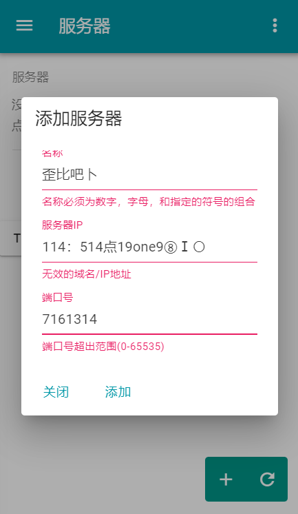

# 
Pegasus Launcher

#### 
Lightweight, Blazingly fast, Newbie-friendly Minecraft launcher.

***

## Why this?

Pegasus Launcher aims for the ultimate compactness and usability. It downloads and install games, handles mods, creates
modpacks, that's it.

Oh, and you can do a bit of customization.

## Why Tauri/Rust?

Rust is **_the_** future. It's fast, secure, and has many features that you would see in higher-level programming
languages like Java.
That's why Tauri became my go-to choice for this project. Not only because it has a crazy small app size compared to
Electron, but also really fast, thanks to Rust. Though there isn't a large community but hey at least we've got a stable
version!

## Well, how usable can it be?

Select a version, click Launch. That’s it. I’m sure you’ll learn in *10 seconds flat*.

No manual configuration is needed, as the launcher has done for you. *Although* you might want to edit that in the
configuration panel.

## Features?

- Download and launch Minecraft (obviously)
- Modpack creating, good for modded server admins
- Multi-account support including Demo/Mojang/Microsoft/Authlib-inject accounts
- Fast download
- Beautiful and overused UI using *Material Design*
- Automatic JRE setup
- Logs recording
- i18n support (for later)
- Bugs. Lots of bugs.

## Forge/LiteLoader/Optifine Support?

No.

Just kidding. Let’s talk about that later.

### fabric?

> Dumb fabric. - Sweetie Belle, S1E18, MLP:FiM

So, duh.

## Okay, sounds pretty good. Where's the download link?

Too bad there's none. Currently it’s a proof-of-concept. **Hopefully**, this launcher can finish in a feaw month, but
LOL I have no guarantee for this project.

For alternatives(and the inspiration of this project), how about
Andy-K-Sparklight’s [Alicorn Launcher](https://github.com/Andy-K-Sparklight/Alicorn).

## Sounds cool! I'm in.

Thanks! Others' contributions are definitely and extremely helpful for this project. Feel free to post issues / pull
requests if you find something that can improve.

***

###### *Special thanks to these amazing project. Without them, this project would **never** finish.*

- Tauri
- Rust
- Vue.js
- Vuetify.js

***
Licensed under Mozilla Public License Version 2.0.

"Minecraft", "我的世界" and its logo are affiliates of Mojang AB.  
"My Little Pony: Friendship is Magic" is affiliated with Hasbro.  
Not Related to Mojang AB, Hasbro and/or other organizations.  
Other trademarks belong to their owner.
